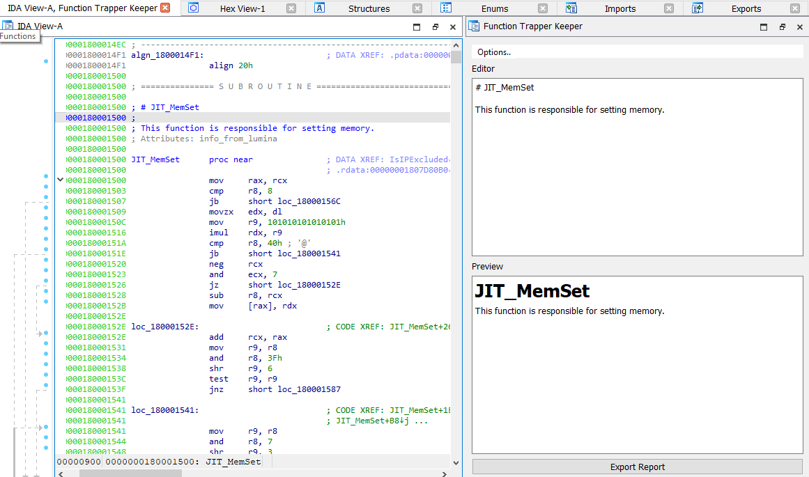

# FunctionTrapperKeeper

Function Trapper Keeper is an IDA plugin for writing and storing notes related to functions in IDBs. Text is entered in
the Editor window and displayed in the Preview window. 
 
## Features  
 Function Trapper Keeper has the following features:
 * Content can be written as plain text or as Markdown.
 * Content is automatically stored as you type in the editor. 
 * Content is refreshed when scrolling from one function to another function.  
 * Content can be optionally written as a Function Comment by selecting `Options.., Add Function Comments`
 * Content can be optionally written as a Function Comment to the Decompiler view by selecting `Options.., 
 Add Function Comments`. 
   * If the Decompiler is not present it the option is not clickable and states `Refresh decompiler comments - Decompiler Not Found`
   * Note: This feature was added because I don't have a personal version of IDA with the decompiler couldn't test what 
   constant refreshes would do the Decompiler view. 
 * All content can be exported as a Markdown (.md) text file. 

## Installation 

Function Trapper Keeper has to be installed as an IDA Plugin. The following steps can be used to 
install the plugin. 

```
git clone https://github.com/alexander-hanel/FunctionTrapperKeeper.git
cd FunctionTrapperKeeper
copy function_trapper_keeper.py %IDAUSR%\plugins 
```
Note: if `%IDAUSR%` is not present or you don't know where this path is on your host, it can be 
found using IDAPython from the Output Window.

```
Python>import ida_diskio
Python>ida_diskio.get_user_idadir()
'C:\\Users\\yolo\\AppData\\Roaming\\Hex-Rays\\IDA Pro'
```
If a directory named `plugins` is not present, it needs to be created. 

### Requirements 
Function Trapper Keeper uses [ida-netnode](https://github.com/williballenthin/ida-netnode). 
Persistent data can be stored in IDA using the "array" set of functions within IDAPython but each node
stores a maximum of 1024 bytes. ida-netnode removes this limitation. For anyone curious about IDA's 
netnodes, ida-netnode's [docstring](https://github.com/williballenthin/ida-netnode/blob/master/netnode/netnode.py#L26) is worth reading. 

The following commands *should* work for installing ida-netnode.  
```
C:\Users\yolo\Documents\repo\FunctionTrapperKeeper>python -m pip install -r requirements.txt
```

or maybe try... 

```
git clone https://github.com/williballenthin/ida-netnode.git
cd ida-netnode 
python setup.py install 
```
Note: If after restarting IDA, the command `from netnode import netnode` fails when imported from IDAPython, 
you might need to use a different version Python to install ida-netnode. I believe the following command can be used
to find the path used by IDAPython. 
 
```
Python>import sys
Python>sys.exec_prefix
'C:\\Users\\yolo\\AppData\\Local\\Programs\\Python\\Python37'
```

## Usage 

### Enable 
`Edit >> Plugins >> Function Trapper Keeper`

or 

`Ctrl-Shift-N` 


#### Example 


## TODO 
 * More testing is needed. Odds are more issues will be found now that I have version ready for daily usage. 
 * Add hot-key to set cursor within editor
 * Add feature to layout the exported content using as parent child rather than order of the function address. 
 * Review Plugin options. I just stole code from [patois](https://github.com/patois) ;) 
 
